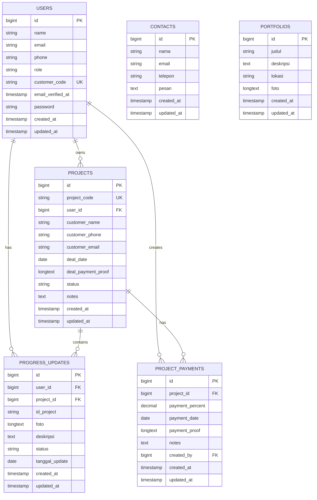
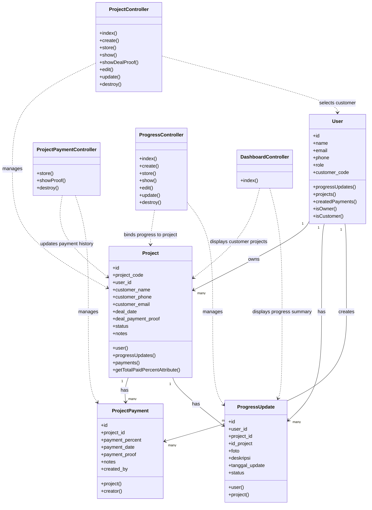

# Dokumentasi Client - Upgrade Website Menjadi Project Management System

Tanggal: 2026-03-08

## 1. Ringkasan Proyek

Website Filia Interior yang semula berfungsi sebagai company profile dan media update progress kini sudah di-upgrade menjadi sistem manajemen proyek sederhana untuk kebutuhan operasional dan monitoring client.

Upgrade ini berfokus pada:

1. Penambahan identitas project yang lebih terstruktur melalui ID Project.
2. Penambahan identitas customer melalui ID Customer.
3. Dukungan repeat order, sehingga 1 customer dapat memiliki banyak project.
4. Histori progress project yang terhubung langsung ke project.
5. Histori pembayaran bertahap per project.
6. Upload dan tampilan bukti pembayaran dealing maupun pembayaran progress.
7. Tampilan dashboard admin dan customer yang lebih modern, responsif, dan lebih dekat ke pola website manajemen proyek.

## 2. Status Implementasi

Fitur di bawah ini sudah diimplementasikan di aplikasi:

### 2.1 Fitur Existing yang Tetap Dipertahankan

1. Halaman publik:
   - Home
   - History
   - Location
   - Portfolio
   - Contact
2. Sistem autentikasi:
   - Login
   - Register
   - Verifikasi email untuk akses dashboard
   - Reset password
3. Role user:
   - `owner` untuk admin
   - `customer` untuk client
4. Manajemen portfolio
5. Form contact masuk ke database
6. Progress update project

### 2.2 Fitur Baru Hasil Upgrade

1. Master data project dengan `project_code` atau ID Project unik.
2. Master data customer dengan `customer_code` atau ID Customer unik.
3. Relasi 1 customer memiliki banyak project.
4. Pencarian project dan progress berdasarkan ID Project, ID Customer, nama customer, email, dan nomor HP.
5. Histori pembayaran project bertahap dengan tanggal, persentase, catatan, dan bukti bayar.
6. Bukti pembayaran dealing awal pada level project.
7. Dashboard customer yang hanya menampilkan project miliknya sendiri.
8. Histori repeat order per customer otomatis terlihat karena semua project terhubung ke customer yang sama.
9. Progress update sekarang terhubung langsung ke project, bukan hanya teks ID project manual.
10. Tampilan modul project management diperbarui agar lebih modern, responsif, dan nyaman dipakai di desktop maupun mobile.

## 3. Arsitektur Sistem Secara Umum

Sistem dibagi menjadi 3 lapisan utama:

### 3.1 Frontend

Frontend dibangun dengan:

1. Laravel Blade
2. Tailwind CSS dan CSS custom
3. Layout dashboard admin dan customer
4. Form upload bukti dan foto progress
5. Halaman list, detail, create, edit, dan monitoring project

Tanggung jawab frontend:

1. Menampilkan daftar project.
2. Menampilkan histori progress dan histori pembayaran.
3. Menyediakan form input untuk admin.
4. Menyediakan dashboard customer yang hanya menampilkan data miliknya.
5. Menampilkan bukti pembayaran melalui endpoint file proof agar stabil di local maupun deploy.

### 3.2 Backend

Backend dibangun dengan Laravel dan Eloquent ORM.

Tanggung jawab backend:

1. Validasi input project, progress, dan pembayaran.
2. Menjaga role access:
   - Admin dapat menambah, edit, hapus project, progress, dan histori pembayaran.
   - Customer hanya dapat melihat project miliknya.
3. Menjaga integritas relasi data antar tabel.
4. Mengirim email notifikasi saat ada update progress.
5. Menangani upload bukti pembayaran dan foto progress.
6. Menyediakan endpoint untuk menampilkan file proof pada local dan deploy.

### 3.3 Database

Database menggunakan MySQL.

Tanggung jawab database:

1. Menyimpan data user dan role.
2. Menyimpan data master project.
3. Menyimpan data histori progress.
4. Menyimpan data histori pembayaran.
5. Menyimpan data contact dan portfolio.
6. Menjaga hubungan antara customer, project, progress, dan payment.

## 4. Detail Fitur yang Sudah Diimplementasikan

### 4.1 Manajemen Customer

Fitur:

1. Setiap customer memiliki `customer_code` unik.
2. Customer juga memiliki data nomor HP pada tabel user.
3. Saat user dengan role `customer` dibuat, sistem akan otomatis generate ID Customer jika belum ada.

Manfaat:

1. Customer mudah dicari.
2. Repeat order lebih mudah dilacak.
3. Dashboard customer menjadi personal karena relasinya langsung ke akun customer.

Contoh format:

- `CUST-0001`
- `CUST-0002`

### 4.2 Manajemen Project

Fitur:

1. Admin dapat membuat project baru.
2. Setiap project memiliki `project_code` unik.
3. Project terhubung ke 1 customer melalui `user_id`.
4. Data customer juga disimpan sebagai snapshot di tabel project:
   - nama customer
   - nomor HP
   - email
5. Project memiliki:
   - tanggal dealing
   - bukti pembayaran dealing
   - status project
   - catatan

Manfaat:

1. Project lebih mudah dicari dan dikelola.
2. Riwayat order customer bisa ditampilkan per customer.
3. Data customer pada project tetap aman sebagai snapshot walaupun profil user berubah.

Contoh format:

- `PRJ-001`
- `PRJ-KITCHEN-2026`

### 4.3 Repeat Order Customer

Fitur:

1. Satu customer dapat memiliki banyak project.
2. Semua project customer akan muncul di dashboard customer yang sama.
3. Admin dapat membuka histori order customer berdasarkan relasi data project.

Manfaat:

1. Saat customer repeat order, histori order lama tidak hilang.
2. Admin bisa melihat semua project milik customer yang sama.
3. Customer bisa memantau seluruh order miliknya dalam satu akun.

### 4.4 Progress Project

Fitur:

1. Progress update sekarang wajib memilih project.
2. Saat progress dibuat:
   - `project_id` disimpan ke tabel progress
   - `user_id` otomatis mengikuti customer pemilik project
   - `id_project` diisi dengan `project_code`
3. Progress menyimpan:
   - tanggal update
   - deskripsi
   - status
   - foto progress
4. Sistem mengirim notifikasi email ke customer saat progress dibuat atau diubah.

Manfaat:

1. Progress tidak lagi terpisah dari project.
2. Monitoring project menjadi lebih akurat.
3. Customer langsung mengetahui ada update progress baru.

### 4.5 Histori Pembayaran Project

Fitur:

1. Admin dapat menambahkan histori pembayaran di halaman detail project.
2. Setiap histori pembayaran menyimpan:
   - tanggal bayar
   - persentase pembayaran
   - catatan
   - bukti pembayaran
   - admin yang membuat input
3. Sistem memvalidasi agar total pembayaran tidak melebihi 100%.
4. Bukti pembayaran dapat dilihat oleh admin dan customer sesuai hak akses.

Contoh alur:

1. Dealing awal disimpan di data project.
2. Pembayaran tahap 1: 10%
3. Pembayaran tahap 2: 25%
4. Pembayaran tahap 3: 30%
5. Dan seterusnya sampai maksimal 100%

Manfaat:

1. Progress pembayaran menjadi transparan.
2. Ada histori lengkap per tanggal.
3. Bukti pembayaran terdokumentasi.

### 4.6 Bukti Pembayaran dan Bukti Progress

Fitur:

1. Bukti dealing disimpan di project.
2. Bukti pembayaran termin disimpan di `project_payments`.
3. Foto progress disimpan di `progress_updates`.
4. Sistem mendukung dua mode penyimpanan:
   - file fisik pada local
   - fallback base64 pada environment deploy tertentu
5. Terdapat endpoint khusus untuk menampilkan proof agar file tetap bisa dilihat baik di local maupun production.

Manfaat:

1. Bukti tetap bisa diakses pada berbagai environment.
2. Tidak bergantung pada cara browser membuka `data:` URL secara langsung.

### 4.7 Dashboard Customer

Fitur:

1. Customer login dan hanya melihat project miliknya sendiri.
2. Dalam dashboard customer, project ditampilkan beserta:
   - ID Project
   - ID Customer
   - status project
   - tanggal dealing
   - total persentase pembayaran
3. Customer juga dapat melihat:
   - histori progress per project
   - histori pembayaran per project
   - bukti pembayaran dealing
   - bukti pembayaran termin

Manfaat:

1. Customer tidak melihat data milik customer lain.
2. Monitoring lebih jelas dan transparan.
3. Dashboard customer menjadi pusat informasi project miliknya.

### 4.8 Pencarian dan Monitoring Admin

Fitur:

1. Admin dapat mencari project berdasarkan:
   - `project_code`
   - `customer_code`
   - nama customer
   - nomor HP
   - email
2. Admin dapat mencari progress berdasarkan:
   - ID project
   - nama customer
   - email
   - nomor HP
   - deskripsi progress

Manfaat:

1. Mempercepat pencarian data.
2. Mempermudah admin saat jumlah project sudah banyak.

### 4.9 Pembaruan UI

Fitur:

1. Modul project management telah diperbarui tampilannya agar lebih modern.
2. Tampilan sudah dirapikan untuk desktop dan mobile.
3. Area yang diperbarui:
   - list project
   - detail project
   - form create/edit project
   - halaman progress
   - dashboard customer
   - modal media proof

Manfaat:

1. Lebih nyaman untuk demo ke client atau dosen.
2. Lebih mudah digunakan oleh admin di layar besar maupun ponsel.

## 5. Workflow Sistem

### 5.1 Workflow Admin

1. Admin login ke dashboard.
2. Admin membuka menu `Projects`.
3. Admin membuat project baru dengan memilih customer.
4. Admin mengisi:
   - ID Project
   - customer
   - nama
   - nomor HP
   - email
   - tanggal dealing
   - bukti pembayaran dealing
   - status
   - catatan
5. Setelah project dibuat, admin dapat membuka detail project.
6. Dari detail project, admin dapat:
   - melihat ringkasan project
   - menambah histori pembayaran
   - melihat bukti pembayaran
   - menghapus histori pembayaran
   - menuju form tambah progress
7. Admin membuka menu `Progress` atau tombol `Tambah Progress`.
8. Admin memilih project, lalu mengisi:
   - tanggal update
   - status
   - deskripsi
   - foto progress
9. Sistem menyimpan progress ke project yang dipilih.
10. Sistem mengirim email notifikasi ke customer terkait.
11. Admin dapat mengedit atau menghapus progress jika diperlukan.

### 5.2 Workflow Customer

1. Customer login ke dashboard.
2. Customer masuk ke dashboard customer.
3. Sistem menampilkan hanya project yang terhubung ke akun customer tersebut.
4. Customer melihat daftar semua project miliknya.
5. Untuk setiap project, customer dapat melihat:
   - ID Project
   - ID Customer
   - status
   - tanggal dealing
   - total pembayaran
   - bukti pembayaran dealing
   - histori pembayaran
   - histori progress
6. Jika customer repeat order, maka semua project miliknya akan tetap tampil dalam akun yang sama sebagai histori order.

### 5.3 Workflow Repeat Order

1. Customer lama melakukan order baru.
2. Admin tidak perlu membuat akun customer baru jika masih customer yang sama.
3. Admin cukup membuat project baru dan memilih customer yang sama.
4. Sistem otomatis menghubungkan project baru tersebut ke customer yang sama.
5. Hasilnya:
   - admin dapat melihat histori semua project customer
   - customer dapat melihat semua project miliknya dalam satu akun

### 5.4 Workflow Pembayaran

1. Dealing awal dicatat pada data project.
2. Setiap pembayaran termin ditambahkan pada histori pembayaran project.
3. Admin mengisi persentase pembayaran per termin.
4. Sistem menghitung total persentase pembayaran project.
5. Sistem menolak input baru jika total pembayaran melebihi 100%.
6. Customer dapat melihat histori pembayaran tersebut dari dashboard.

## 6. Hak Akses

### 6.1 Admin atau Owner

Admin dapat:

1. Melihat semua project
2. Menambah project
3. Mengedit project
4. Menghapus project
5. Menambah histori pembayaran
6. Menghapus histori pembayaran
7. Menambah progress
8. Mengedit progress
9. Menghapus progress
10. Melihat semua data customer terkait project
11. Melihat semua bukti pembayaran dan bukti progress

### 6.2 Customer

Customer dapat:

1. Login
2. Melihat dashboard miliknya
3. Melihat project miliknya
4. Melihat histori progress project miliknya
5. Melihat histori pembayaran project miliknya
6. Melihat bukti pembayaran project miliknya

Customer tidak dapat:

1. Menambah project
2. Mengubah project
3. Menambah progress
4. Menambah histori pembayaran
5. Menghapus data
6. Melihat project milik customer lain

## 7. Struktur Tabel Database

Bagian ini fokus pada tabel yang relevan terhadap fitur project management dan modul utama sistem.

### 7.1 Tabel `users`

Fungsi:

Menyimpan data akun admin dan customer.

Kolom penting:

| Kolom | Tipe | Fungsi |
| --- | --- | --- |
| `id` | bigint | Primary key user |
| `name` | string | Nama user/customer |
| `email` | string unique | Email login |
| `phone` | string nullable | Nomor HP customer |
| `password` | string | Password terenkripsi |
| `role` | enum | `owner` atau `customer` |
| `customer_code` | string unique nullable | ID customer unik |
| `email_verified_at` | timestamp nullable | Status verifikasi email |
| `created_at` | timestamp | Waktu dibuat |
| `updated_at` | timestamp | Waktu diubah |

Catatan:

1. `customer_code` otomatis dibuat untuk role `customer`.
2. Satu user customer dapat memiliki banyak project.

### 7.2 Tabel `projects`

Fungsi:

Menyimpan master data project.

Kolom penting:

| Kolom | Tipe | Fungsi |
| --- | --- | --- |
| `id` | bigint | Primary key project |
| `project_code` | string unique | ID Project unik |
| `user_id` | foreign key | Relasi ke customer pemilik project |
| `customer_name` | string | Snapshot nama customer pada project |
| `customer_phone` | string nullable | Snapshot nomor HP customer |
| `customer_email` | string | Snapshot email customer |
| `deal_date` | date nullable | Tanggal dealing |
| `deal_payment_proof` | longText nullable | Bukti pembayaran dealing |
| `status` | string | Status project |
| `notes` | text nullable | Catatan internal project |
| `created_at` | timestamp | Waktu dibuat |
| `updated_at` | timestamp | Waktu diubah |

Catatan:

1. `user_id` menghubungkan project ke customer.
2. Snapshot customer disimpan agar histori project tetap stabil walaupun data profil user berubah.

### 7.3 Tabel `project_payments`

Fungsi:

Menyimpan histori pembayaran bertahap per project.

Kolom penting:

| Kolom | Tipe | Fungsi |
| --- | --- | --- |
| `id` | bigint | Primary key pembayaran |
| `project_id` | foreign key | Relasi ke project |
| `payment_percent` | decimal(5,2) | Persentase pembayaran termin |
| `payment_date` | date | Tanggal pembayaran |
| `payment_proof` | longText nullable | Bukti pembayaran termin |
| `notes` | text nullable | Catatan pembayaran |
| `created_by` | foreign key nullable | Admin/user yang membuat histori pembayaran |
| `created_at` | timestamp | Waktu dibuat |
| `updated_at` | timestamp | Waktu diubah |

Catatan:

1. Satu project memiliki banyak histori pembayaran.
2. Validasi total pembayaran maksimal 100%.

### 7.4 Tabel `progress_updates`

Fungsi:

Menyimpan histori perkembangan pekerjaan project.

Kolom penting:

| Kolom | Tipe | Fungsi |
| --- | --- | --- |
| `id` | bigint | Primary key progress |
| `user_id` | foreign key | Customer pemilik progress |
| `project_id` | foreign key nullable | Relasi ke project |
| `id_project` | string | Kode project untuk kompatibilitas data lama |
| `foto` | longText nullable | Foto progress |
| `deskripsi` | text | Keterangan progress |
| `tanggal_update` | date | Tanggal update |
| `status` | string nullable | Status progress |
| `created_at` | timestamp | Waktu dibuat |
| `updated_at` | timestamp | Waktu diubah |

Catatan:

1. Kolom `project_id` adalah penghubung baru ke tabel `projects`.
2. Kolom `id_project` tetap dipertahankan untuk kompatibilitas data lama dan kemudahan referensi.

### 7.5 Tabel `contacts`

Fungsi:

Menyimpan pesan masuk dari halaman contact.

Kolom penting:

| Kolom | Tipe | Fungsi |
| --- | --- | --- |
| `id` | bigint | Primary key |
| `nama` | string | Nama pengirim |
| `email` | string | Email pengirim |
| `telepon` | string | Nomor telepon |
| `pesan` | text | Isi pesan |
| `created_at` | timestamp | Waktu dibuat |
| `updated_at` | timestamp | Waktu diubah |

### 7.6 Tabel `portfolios`

Fungsi:

Menyimpan data portfolio yang ditampilkan di website.

Kolom penting:

| Kolom | Tipe | Fungsi |
| --- | --- | --- |
| `id` | bigint | Primary key |
| `judul` | string | Judul portfolio |
| `deskripsi` | text | Deskripsi portfolio |
| `lokasi` | string | Lokasi project portfolio |
| `foto` | longText atau string | Media portfolio |
| `created_at` | timestamp | Waktu dibuat |
| `updated_at` | timestamp | Waktu diubah |

## 8. Relasi Antar Tabel

Relasi utama modul baru:

1. `users (customer)` 1 ke banyak `projects`
2. `projects` 1 ke banyak `project_payments`
3. `projects` 1 ke banyak `progress_updates`
4. `users` 1 ke banyak `progress_updates`
5. `users` 1 ke banyak `project_payments` melalui kolom `created_by`

Penjelasan:

1. Satu customer dapat memiliki banyak project.
2. Satu project dapat memiliki banyak termin pembayaran.
3. Satu project dapat memiliki banyak update progress.
4. Progress tetap menyimpan pemilik customer agar dashboard customer mudah difilter.
5. Histori pembayaran menyimpan siapa admin yang membuat input.

## 9. ERD

Diagram ERD berikut mewakili struktur relasi utama modul project management.

## 10. Class Diagram

Diagram berikut berfokus pada class backend inti yang menangani modul project management.

## 11. Ringkasan Route Modul Baru

Route utama yang terkait upgrade:

| Method | Route | Fungsi |
| --- | --- | --- |
| `GET` | `/dashboard/projects` | List project |
| `GET` | `/dashboard/projects/create` | Form tambah project |
| `POST` | `/dashboard/projects` | Simpan project |
| `GET` | `/dashboard/projects/{project}` | Detail project |
| `GET` | `/dashboard/projects/{project}/edit` | Form edit project |
| `PUT/PATCH` | `/dashboard/projects/{project}` | Update project |
| `DELETE` | `/dashboard/projects/{project}` | Hapus project |
| `GET` | `/dashboard/projects/{project}/deal-proof` | Tampilkan bukti dealing |
| `POST` | `/dashboard/projects/{project}/payments` | Tambah histori pembayaran |
| `GET` | `/dashboard/projects/{project}/payments/{payment}/proof` | Tampilkan bukti pembayaran termin |
| `DELETE` | `/dashboard/projects/{project}/payments/{payment}` | Hapus histori pembayaran |
| `GET` | `/progress` | List progress |
| `POST` | `/progress` | Tambah progress |
| `PUT/PATCH` | `/progress/{progress}` | Update progress |
| `DELETE` | `/progress/{progress}` | Hapus progress |

## 12. Mekanisme Migrasi Data Lama

Sistem juga sudah menangani data lama melalui proses backfill.

Yang dilakukan:

1. Customer lama yang belum punya `customer_code` akan diberi kode otomatis.
2. Data progress lama yang hanya memiliki `id_project` akan dipetakan menjadi data `projects`.
3. Field `progress_updates.project_id` akan diisi berdasarkan hasil mapping tersebut.
4. Dengan cara ini, data lama tetap bisa dipakai tanpa menghilangkan histori.

## 13. Keunggulan Hasil Upgrade

1. Website tidak lagi hanya menampilkan company profile, tetapi sudah memiliki modul operasional project.
2. Project dapat dicari lebih cepat dengan ID Project dan ID Customer.
3. Repeat order lebih tertata karena relasi customer ke banyak project sudah ada.
4. Histori pembayaran lebih transparan dan terdokumentasi.
5. Customer memiliki dashboard yang relevan hanya untuk datanya sendiri.
6. Struktur database lebih siap untuk dikembangkan lebih lanjut, misalnya:
   - invoice
   - task management
   - dokumen kontrak
   - laporan project
   - export PDF atau Excel

## 14. Kesimpulan

Secara fungsional, sistem saat ini sudah berhasil di-upgrade dari website company profile biasa menjadi website dengan fitur manajemen project yang lebih terstruktur.

Hal utama yang sudah tercapai:

1. Identitas customer dan project sudah unik dan dapat dicari.
2. Repeat order sudah didukung.
3. Progress sudah berbasis project.
4. Pembayaran bertahap sudah memiliki histori dan bukti.
5. Customer dapat memonitor project miliknya sendiri.
6. UI modul baru sudah lebih modern dan responsif.

Dokumen ini dapat digunakan untuk:

1. Penjelasan ke client
2. Lampiran jurnal atau skripsi
3. Presentasi ke dosen pembimbing
4. Referensi pengembangan tahap berikutnya
